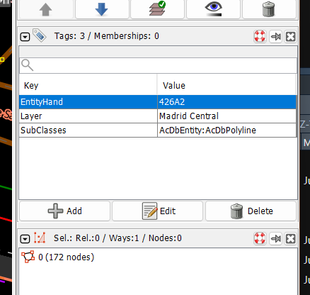
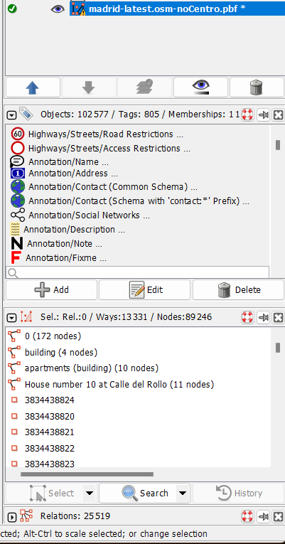
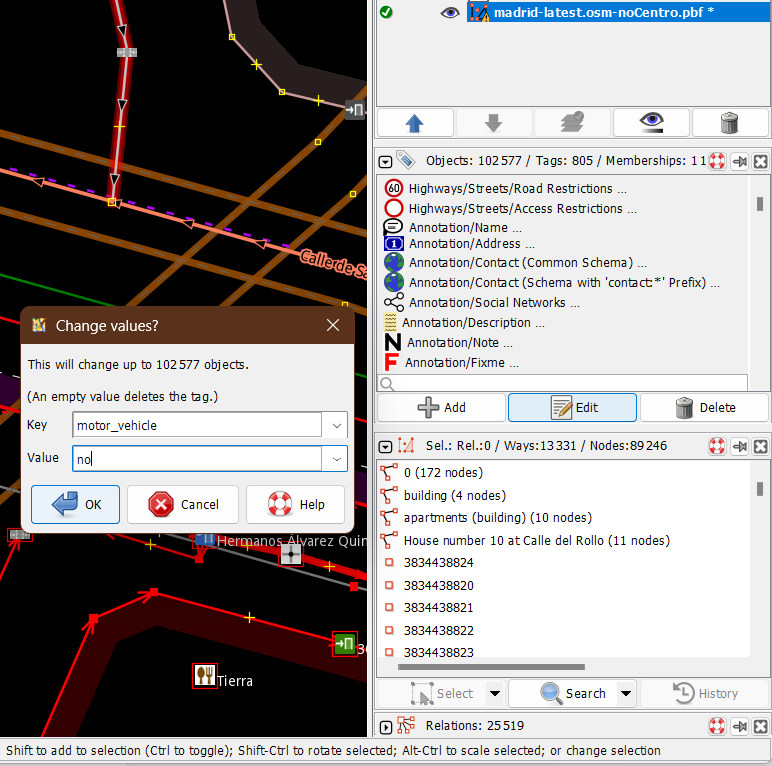
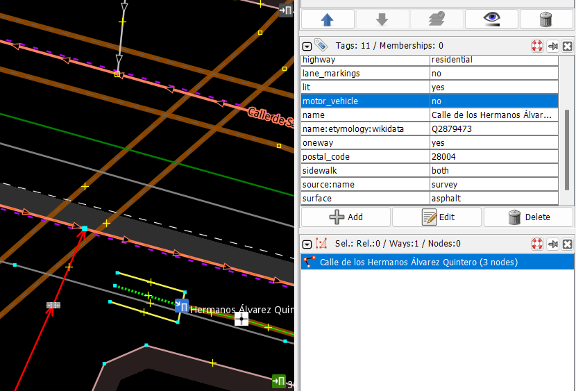

```{r setup, include=FALSE}
knitr::opts_chunk$set(echo = FALSE, warning = FALSE, message = FALSE)
```
```{r}
library(ggplot2)
library(hexbin)
library(sf)
library(r5r)
library(data.table)
library(ggspatial)
options(java.parameters = "-Xmx6G")
```

```{r, eval=FALSE}
dir.create("data-raw/r5_graph")
r5_path <- file.path("data-raw/r5_graph")

r5r_core <- setup_r5(r5_path)
# extract OSM network
street_net <- street_network_to_sf(r5r_core)
main_roads <- subset(street_net$edges, street_class %like% 'MOTORWAY|PRIMARY|SECONDARY')
```

```{r loading-data, eval=FALSE}
buildings_osm <- read_sf("data-raw/madrid-latest-free.shp/gis_osm_buildings_a_free_1.shp")
buildings_osm <- st_centroid(buildings_osm)
```


Estimated using [{r5r}](https://ipeagit.github.io/r5r/), the centroids of a buildings from the Madrid Open Street Map (downloaded June-6-2024), the Madrid OSM road network (June-6-2024), and all available GTFS feeds (March-6-2024). What's included:

The all-buildings-to-all-buildings travel time matrices (car, transit, walk, bike): 
- On the unedited OSM road network and GTFS files,
- On the edited OSM road network (no cars allowed within Madrid Centro) and unedited GTFS files,
- On the edited OSM road network (no cars allowed within Madrid M30) and unedited GTFS files.

Heatmap of buildings (summarized by hexagons) and main roads:
```{r map-of-buildings, echo=FALSE, eval=FALSE}
roads_buildings_plot <- ggplot() +
  geom_hex(data = buildings_osm, aes(x=st_coordinates(buildings_osm)[,1],
                                     y=st_coordinates(buildings_osm)[,2]),
           color = NA)+
  scale_fill_gradient(low = 'grey80', high = 'orchid4',limits=c(1, 15800),
                       name = "No. of buildings", breaks = c(1,4000,8000,12000,15800))+
  
  geom_sf(data = main_roads, aes(color = street_class), size=0.01, alpha = 0.2) +
  scale_color_discrete(type = c("grey55", "yellow4", "green4"), name = "Main roads")+
  annotation_scale(location = 'bl') +
  annotation_north_arrow(location = 'tr')+
  theme_minimal() +
  theme(axis.title = element_blank())

ggsave(plot = roads_buildings_plot, filename = "figures/roads_buildings_plot.png")
```
```{r plot-figure1, out.width=600, out.height=600, echo=FALSE}
#| fig-cap: "The main roads and building centroids in the Community of Madrid, retrieved from OSM June 6 2024"
knitr::include_graphics(glue::glue(here::here(), "/figures/roads_buildings_plot.png")) 
```


### Editing the OSM .pbf file to exclude vehicle access:

Included in this repo are the unedited OSM road network "madrid-latest-osm.pbf", and two edited files "madrid-latest-osm-NoCentro.pbf" and "madrid-latest-osm-NoM30.pbf". All three are used to produce routing times for car mode. Routing times are produced for the other three modes using "madrid-latest-osm.pbf" -- as they are not impacted by the edits to the road network in "madrid-latest-osm-NoCentro.pbf" and "madrid-latest-osm-NoM30.pbf".

- Create a new copy of "madrid-latest-osm.pbf" file. Rename it to "madrid-latest-osm-NoCentro.pbf"

- Download [JOSM](https://josm.openstreetmap.de/)

- Install the "UtilsPlugin2" plugin, see here: https://wiki.openstreetmap.org/wiki/JOSM/Plugins#Installation

- In JOSM open the "madrid-latest-osm-NoCentro.pbf" file and the "ZBE-Centro.shp" (retrieved from [Madrid datos abiertos](https://datos.madrid.es/portal/site/egob/menuitem.c05c1f754a33a9fbe4b2e4b284f1a5a0/?vgnextoid=019f24aaef3d3610VgnVCM1000001d4a900aRCRD&vgnextchannel=374512b9ace9f310VgnVCM100000171f5a0aRCRD&vgnextfmt=default))

- In the layers panel, merge ZBE-Centro.shp and madrid-latest-osm-NoCentro.pbf, with madrid-latest-osm-NoCentro.pbf being the 'target' layer. Click Continue. 

- Zoom in and find the "ZBE-Centro.shp" within the newly merged file. It should have a Layer label with value "Madrid Central". You want to select it. You know you've selected it when the Membership panel looks like this:


- On the top dropdown bar, select "Selection" -> All inside [testing]. Now everything inside the merged ZBE-Centro.shp will be selected. The Membership panel should look like this:



- Click the edit button in the Selection panel. In the Change Value window that pops up, change the "motor_vehicle" key to the value "no" (see details about the [motor_vehicle OSM tag](https://wiki.openstreetmap.org/wiki/Key:motor_vehicle)). Click Overwrite. This step should look like this:
. 

- Confirm that you've modified the roads. Do so by clicking on a street that's been modified,  in the Membership panel you should now see a label for motor_vehicle with a value of no. You can also check a few streets outside the ZBE-Centro boundary, you'll see they likely do not have a motor_vehicle label, and if they do, it is likely not no. For the streets inside the zone, the Membership panel should look like this: 
.

- Now right click on the layer in the Layers panel, and save the .pbf file. You can overwrite the madrid-latest-osm-NoCentro.pbf file, as this is the new one!

- Repeat these steps using the "madrid-latest-osm-NoM30.pbf" and the "ZBE-M30.shp" (Javier created this, it is the area inside the M30 - so motor_vehicles are still allowed on the M30.

Now, we 3 osm.pbf files:

- madrid-latest-osm.pbf (original) - will be used to estimate "calc_cartt_nores.Rdata", "calc_transittt.Rdata", "calc_walktt.Rdata", "calc_bikett.Rdata". 
- madid-latest-noM30.osm.pbf (all motor vehicles are restricted within the M30 area)  - will be used to estimate "calc_cartt_noM30.Rdata"
- madid-latest-NoCentro.osm.pbf (all motor vehicles are restricted within the LEZ Centro)  - will be used to estimate "calc_cartt_noCentro.Rdata"

Additional check: I will try to route the "walk" travel times using the modified .pbf files. I expect them to yield the exact same travel times as the non modified .pbf file, while the car travel times should yield different results. This is what we want! 

### Multimodal travel time matrices demonstration

